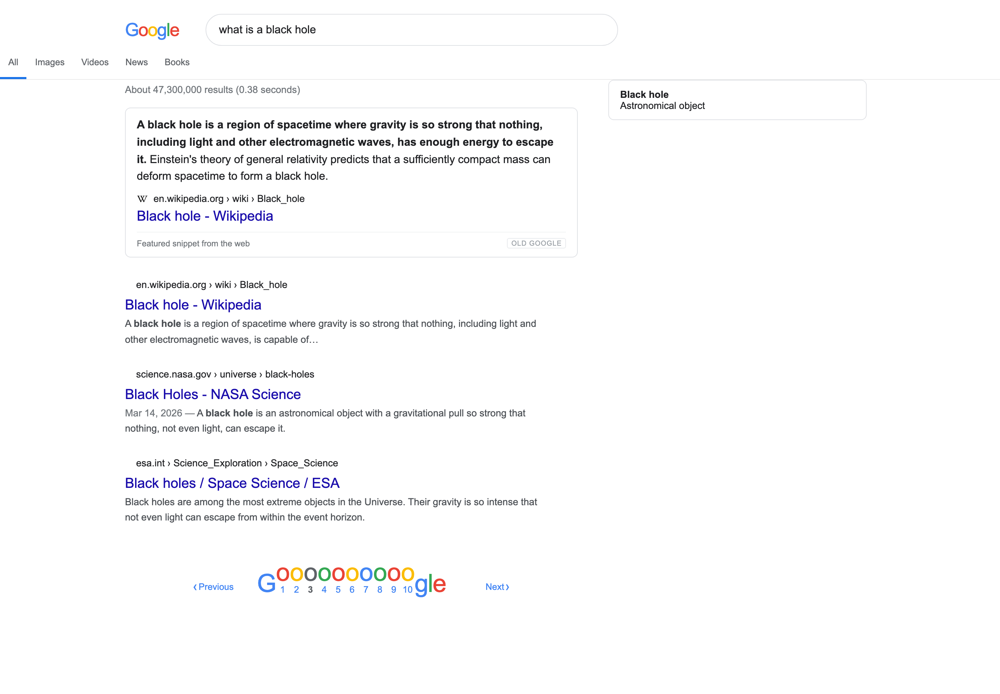

# Old Google (2020)

A Chrome extension that gives google.com its 2020 face back — **without** giving up 2026's index.

Four things, in order of how much you'll notice them:

1. **The AI Overview is gone.** So is the AI Mode tab, the AI button in the search box, and the Labs promos.
2. **A real featured snippet comes back.** One box at the top, quoted verbatim from **one** website, with that site's favicon, URL and title underneath — the way snippets worked before they got replaced by a generated paragraph stitched from five sources.
3. **The definition panel is back.** "gazelle definition", "define ephemeral",
   "synonyms for happy" open the built-in dictionary box again — word,
   pronunciation, part of speech, numbered senses, examples, similar words —
   instead of a featured snippet quoting a dictionary site's citation line.
4. **The 2020 skin.** Arial, 20px blue titles at `#1a0dab`, a 652px column offset 180px from the left, grey `#4d5156` snippets, the flat tab strip, and the numbered `Gooooooogle` pager instead of infinite scroll.

The header is left alone (see below). The results themselves are untouched — they're today's live Google results. Only the chrome around them is 2020.



---

## Installing

> **Heads up:** you don't currently have Chrome installed. This is a Manifest V3
> extension, so it works in any Chromium browser — Chrome, Edge, Brave, Arc,
> Vivaldi, Opera, or plain Chromium. It will **not** work in Safari without being
> repackaged as a Safari Web Extension.

0. Fetch the binaries the repo does not carry (the 63 MB model and the ONNX
   Runtime WASM build):

   ```sh
   ./tools/fetch-model.sh
   ```

   Skip this and everything still works — passage ranking just falls back to
   keyword scoring.

1. Open `chrome://extensions` (or `edge://extensions`, `brave://extensions`, …).
2. Turn on **Developer mode** (top right).
3. Click **Load unpacked** and pick this folder: `/Users/audrey/old-google`.
   (It is ~78 MB, almost entirely the bundled model — see below.)
4. Go to google.com and search for something.

Click the toolbar icon for settings.

### About the permission prompt

The extension asks to "read and change data on all sites." That's the price of
feature 2: to quote a passage from the top result's page, the background worker
has to fetch that one page. It is the only thing that permission is used for.
Nothing is sent anywhere — no analytics, no server, no telemetry. If you'd rather
not grant it, set **Featured snippet → Only Google's own** in the popup and the
extension never makes a network request.

---

## How the featured snippet is built

When you search, the extension:

1. Checks whether Google served a real featured snippet. If it did, that one wins — it just gets re-dressed in 2020 styling.
2. Otherwise it takes the **#1 organic result**, fetches that page in the background, and picks the passage a 2020 snippet would have quoted:
   - a **paragraph** for definitional queries ("what is a black hole"),
   - an **ordered list** for how-to queries ("how to make cold brew"),
   - a **table** for comparisons ("black hole classes comparison").
   The sentence that actually answers the question is bolded, exactly like the old ones.
3. If that page can't be fetched or has nothing quotable, it tries the #2 and #3 results, then falls back to quoting the top result's own index description.

### How the passage is chosen

Google ranked passages with BERT. So does this, locally:

- **A bundled question-answering model** (`distilbert-base-uncased-distilled-squad`,
  ONNX int8, 63 MB) scores each candidate passage by how strongly it believes an
  answer to your query is present in it — the best answer-span logit minus the
  `[CLS]` "no answer here" baseline. It runs on ONNX Runtime WASM inside an
  offscreen document. Nothing is sent anywhere; there is no API and no key.
  Turn it off in the popup and the extension falls back to keyword scoring.
- **Anchored on Google's own pick.** The one-line description under a result *is*
  Google's passage selection for that query, just truncated. The extractor
  locates that text in the source page and returns the full sentences around it.
- **Keyword scoring** by stemmed term coverage, judging a passage by its best
  single sentence as well as by the whole.

The three are blended: the model is the largest single term but not a dictator,
and if it finds no confident answer anywhere on the page the keyword order
stands.

- **Anchors on Google's own pick.** The one-line description Google prints under
  a result *is* its passage selection for that exact query — just truncated with
  an ellipsis. The extractor locates that text in the source page and returns the
  full sentences around it. This is the strongest signal by far and the closest
  thing to how snippets actually worked; it is also why the box usually says more
  than the description under the result did.
Keyword scoring also **penalises throat-clearing** ("in this article we'll
explore…") decisively, and **ignores the `<h1>`** when weighing headings — on any
page that ranks for the query the title matches the query, so counting it
rewarded every paragraph near the top equally.

On a 10-query benchmark of passages where the answer shares no words with the
question, keyword scoring alone gets 7/10 and the model gets 9/10:

| query | keyword picks | model picks |
| --- | --- | --- |
| what do gazelles eat | *habitat* | *diet* |
| why is the sky blue | *sunset* | *scattering* |
| when was the Great Wall built | *length* | *Qin dynasty* |

### Why a QA model and not a reranker

A cross-encoder reranker (`ms-marco-MiniLM-L-6-v2`, 22 MB) was tried first and
scored **worse than keyword matching** — 1/3, ranking content-farm preamble above
the passage that answered the question. That was not a quantization artifact:
fp32 gave the same scores. A reranker measures *topical relevance*, and a
paragraph restating the query is maximally on-topic. "Does this passage contain
the answer, and where" is the question a featured snippet actually asks, and
that is extractive QA.

### Remaining gaps

No cross-passage reasoning — by design, that is what AI Overviews do. No way to
tell a well-written answer from a confident-sounding wrong one; nobody has solved
that. And when nothing scores well enough it shows Google's description rather
than guessing.

Step 2 is a network round trip, so the box does not wait on it: the top result's
index description is quoted **immediately** (labelled "Description from the web",
no network needed) and the extracted passage replaces it in place when it lands
(relabelled "Featured snippet from the web"). If extraction finds nothing, the
description simply stays.

Key property: **one source, verbatim, always attributed.** Nothing is generated, summarised, or blended across sites. If no site says it, the box doesn't appear.

The fetched HTML is parsed with an inert `DOMParser` — no scripts run, no subresources load — and only `textContent` ever reaches the page. Pages that send `X-Robots-Tag: nosnippet` or `noarchive` are skipped. Responses are capped at 2 MB, timed out at 9s, cached for 6 hours, and rate-limited to one request per host per 1.5s.

---

## Settings

| Setting | Default | What it does |
| --- | --- | --- |
| Remove AI Overview & AI Mode | on | Hides the generated summary, the AI Mode tab, the search-box AI button, Labs promos |
| 2020 look | on | The skin |
| Follow dark mode | on | Match Google's theme. Off forces the light palette |
| Green URLs | off | Goes further back — the pre-2016 `#006621` |
| Numbered pages | on | Restores the `Gooooooogle` pager |
| Rank passages with the built-in model | on | The local 63 MB QA model. Off = keyword scoring only, no model loaded |
| Definition & synonym panel | on | The built-in dictionary box for define/synonym queries |
| Hide the footer bar | on | Drops "Results are not personalized" and the location line |
| Featured snippet | Build from top result | `synthesize` / `google` / `off` |
| Prefer Wikipedia | off | When Wikipedia is on page one, quote it first |
| Extra selectors to hide | — | Your own CSS selectors, one per line |
| Custom CSS | — | Anything else |
| Debug logging | off | Logs what got hidden and where the snippet came from |

---

## When Google breaks it

Google renames its obfuscated CSS classes constantly, and the AI Overview's
container name changes with them. The extension is built to survive that:

- `hide-ai.css` keys off **attributes and aria-labels** (`[data-subtree="aio"]`, `[aria-label="AI Overview"]`, `a[href*="udm=50"]`), not class names.
- `10-purge.js` is a second net: it finds elements whose text or `aria-label` *is* "AI Overview" / "AI-powered overview" / "AI Mode" and hides the enclosing result block. It refuses to touch `#rcnt`, `#center_col`, `#rso` and friends, so a false positive can't blank the page.
- `40-theme.js` stamps its **own** stable class names (`og-result`, `og-title`, `og-cite`, `og-snippet`) on each result, and the stylesheet targets those.

If something still leaks through: turn on **Debug logging**, right-click the
offending block → Inspect, find an attribute that identifies it, and paste a
selector into **Extra selectors to hide**. No reload of the extension needed.

---

## Layout

```
manifest.json                    MV3 manifest, www.google.* only
src/background/service-worker.js the one-page fetch proxy (cache, timeout, rate limit)
src/content/hide-ai.css          AI removal, injected at document_start (no flash)
src/content/theme-2020.css       the skin
src/content/snippet.css          the featured snippet card
src/content/00-state.js          settings, helpers, html class toggles
src/content/10-purge.js          heuristic AI sweep
src/content/20-extract.js        paragraph / list / table extraction + scoring
src/content/25-dictionary.js     definition / synonym panel
src/offscreen/offscreen.html     hosts the model; kept alive between queries
src/offscreen/offscreen.js       ONNX session, span scoring, null-score baseline
src/offscreen/wordpiece.js       BERT WordPiece tokenizer (browser + Node)
vendor/model/                    the bundled model — see vendor/model/SOURCE.md
vendor/ort/                      ONNX Runtime WASM
src/content/30-snippet.js        source selection, fetch, render, mount
src/content/40-theme.js          stable hooks, the Gooooooogle pager
src/content/50-main.js           orchestration, MutationObserver, live settings
src/popup/                       settings UI
demo/serp.html                   a fake SERP that drives the real modules offline
demo/serp-hostile.html           a SERP built to reproduce known breakages
demo/serp-images.html            the Images vertical: a full-bleed grid, no column
demo/serp-dictionary.html        a definition query with a stubbed lookup
test/extract.test.js             37 assertions against the extractor, under jsdom
test/snippet-timing.test.js      8 assertions: the box is never empty while the
                                 source page is being fetched
test/verticals.test.js           26 assertions: Images/Videos/Shopping must not
                                 get the text-column geometry forced on them
test/wordpiece.test.js           27 assertions: tokenizer pinned to known ids
test/inference.test.js           12 assertions end-to-end in a real browser with
                                 the extension loaded: model, determinism, limits
test/dark.test.js                21 assertions: WCAG contrast for every piece of
                                 text, in both themes
test/dictionary.test.js          33 assertions: which queries open the panel,
                                 what it renders, and that API text is inert
test/purge.test.js               29 assertions in real Chromium: the header, the
                                 tab strip, the footer and the results must all
                                 survive the purge and the restyle
tools/make-icons.py              regenerates the icons, no dependencies
tools/diagnose.js                runs the extension against a real captured SERP
```

## Development

```sh
cd test && npm install
node extract.test.js    # 37 assertions on the extractor (jsdom)
node purge.test.js           # 29 assertions on the purge + layout (real Chromium)
node dictionary.test.js      # 33 assertions on the definition panel
node dark.test.js            # 21 assertions on dark mode contrast
node wordpiece.test.js       # 27 assertions on the tokenizer
node inference.test.js       # 12 assertions on the model, in a real browser
node verticals.test.js       # 26 assertions on Images/Videos/legacy verticals
node snippet-timing.test.js  # 8 assertions on the provisional-then-upgrade card
node layout.js          # column geometry at 1440/1280/1150/1024
node shot.js            # re-renders demo/preview.png
```

`demo/serp.html` opens in any browser with no extension installed — it stubs
`chrome.*`, feeds a canned article to the extractor, and runs the real purge,
theme, pager and snippet code against a mock SERP.

## What this does NOT touch: the header

The search box, the tab strip and the rule under it are left exactly as Google
renders them. Earlier versions rebuilt all three in 2020 dress, and every
override broke something no fixture predicted: the header vanished outright,
"More"/"Tools" wrapped onto their own lines, a second pill nested inside
Google's, Google's tab rule was erased on one tab and doubled on another, the
search box drifted off-centre, and the Images grid overflowed sideways.

That is structural, not a run of typos. The header's layout is Google's, built
from flex containers whose shape is invisible from an extension and changes
without notice. Restyling markup you cannot see works for leaf properties and
fails for anything participating in layout.

Google's current header is already close to 2020 — white, a rounded pill, a tab
strip with a blue underline. The remaining difference was not worth the
breakage. What makes a SERP feel like 2020 is the results column, and that is
still fully restyled.

### Dark mode

The skin follows Google's theme rather than forcing a palette. Every colour is a
CSS variable with a dark counterpart (Google's own dark values: `#202124`
ground, `#e8eaed` text, `#8ab4f8` links). Dark mode is detected by measuring the
*search field's* text colour — the header is the one thing the extension never
restyles, so its colours are Google's and can be trusted.

An earlier version forced white backgrounds while leaving Google's light-grey
text alone, which dropped "People also ask" to a contrast ratio of 1.21:1 —
invisible. `test/dark.test.js` measures the contrast of every piece of text
against whatever is actually painted behind it, in both themes.

### The gutter

The 2020 results column sat 180px from the left. That offset used to be padding
on `#cnt`/`#rcnt` — but Google's tab strip lives inside those, so the tabs and
the rule under them were shifted along with the results. The rule appeared to
start partway across the page instead of at the window edge, and switching to a
tab that does not get the offset (Images, Videos) made the whole header jump
sideways.

The offset now goes on the columns themselves, and its size is measured from
where Google actually puts the tab text (`--og-gutter`, set by `40-theme.js`).
The column lines up with the tabs on every tab and at every width, and the
header is left alone — which is the rule everywhere else here.

## Two rules this skin follows

1. **Restyle appearance, never layout.** Colour, font, border and radius are
   safe to override on markup we do not control. `display`, `float`, `position`,
   `width` and `padding` are not — every time this skin forced those onto a
   Google container it broke something (the header vanished, the tab row wrapped,
   the Images grid overflowed sideways). The only layout the extension owns is
   the results column, and that is gated to the text-results tab.
2. **Pick elements structurally, not by class name.** Google's obfuscated class
   names get recycled onto unrelated elements. Everything load-bearing — the
   gutter container, tab rule, search box, favicon, footer — is located by
   walking the DOM and marked with the extension's own `og-*` hook.

## Safety invariant

`10-purge.js` will not hide any element that contains the search box, the results
container, or more than one result title — so a wrong guess about which block is
"the AI one" costs at most that block, never the page. Class-name guesses are
additionally scoped to inside `#rcnt`, because Google recycles its obfuscated
class names and one of them landing on a header container would otherwise take
the search box with it. `test/purge.test.js` holds that line.

## Capturing a real SERP

Google serves a CAPTCHA to automated browsers, so the live DOM cannot be driven
from a script. To debug against the real page, capture it by hand:

1. Open the Google results page you want to fix.
2. Open DevTools (Cmd+Opt+I) → Console, and paste:

   ```js
   const b = new Blob([document.documentElement.outerHTML], {type:'text/html'});
   const a = document.createElement('a');
   a.href = URL.createObjectURL(b); a.download = 'live-serp.html'; a.click();
   ```

3. Move the downloaded file to `demo/live-serp.html`.
4. `node tools/diagnose.js demo/live-serp.html "your query"`

That strips the page's scripts (nothing runs, nothing is fetched), injects the
extension the way Chrome would, and prints what each hook actually matched —
plus `demo/live-diagnose.png`. The captured file contains your search query and
whatever the SERP showed you, and stays on your machine.

### Where the definitions come from

`api.dictionaryapi.dev` (Wiktionary data, free, no key). Only the single word is
sent, and only for queries that clearly ask for a definition — "how to define a
function in python" and "what does a gazelle eat" do not trigger it. Turn the
panel off in the popup and no request is ever made. API strings are inserted as
text, never markup.

## Known limits

- Desktop only. Mobile Google's DOM is different enough to need its own pass.
- The pager synthesises `&start=` links. Google may still choose to serve a continuous feed for some queries; the numbered links work regardless.
- Some sites (Cloudflare interstitials, hard paywalls) can't be fetched. The extension falls back to the next result, then to Google's own description.
- Trademarks belong to Google; this only restyles pages you already loaded, and ships none of their assets.
